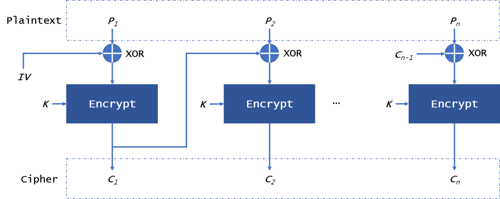

## Criptografia

A criptografia é uma estrateǵia utilizada no campo de cyber security de modo a manter dados protegidos fora do alcance
de invasores transformando texto plano em um código que possa ser entendido apenas por alguém que possuir a chave para
traduzir o código para seu formato em texto original.

A criptografia também pode ser entendida como um processo matemático qual realiza o cálculo de um texto cifrado a partir
de um texto plano de entrada utilizando algoritmos complexos tornando o resultado impraticável de reverter sem a posse
da chave utilizada para gerar o texto cifrado no primeiro momento.

Esse processo pode ser realizado de maneira síncrona, onde a mesma chave é utilizada para criptografar e descriptografar
um dado a ser protegido, ou de maneira assíncrona onde chaves diferentes são utilizadas em ambos os processos.

## Criptografia simétrica

A estratégia mais simples de criptografia considera uma cifra que realiza uma criptografia. Quanto a sua terminologia,
uma mensagem é um texto plano que ainda não foi criptografado.

Esse texto é criptografado utilizado uma cifra, ou melhor, um algoritmo de criptografia sobre o controle de uma chave
secreta e a sua combinação produz um texto cifrado.

Esse texto cifrado pode ser descriptografado com a mesma chave secreta tendo como resultado a mensagem tem texto plano
original. Na criptografia simétrica é sempre utilizada a mesma chave tando para criptografar quanto para descriptografar
uma mensagem. Os termos mensagem ou texto plano são geralmente utilizados para denominar um conteúdo que ainda não foi
criptografado. Um ciphertext ou texto cifrado se refere a um conteúdo criptografado.

O operador binário XOR é muito utilizado em criptografia visto seu relacionamento entre dois valores onde é retornando
true quando qualquer um de dois valores é verdadeiro, porém não ambos. O operador XOR atua como um inversor (flip) de
bits em uma mensagem quando considerado em uma tabela verdade. Um fato interessante é o de que a aplicação seguida do
XOR reverte o seu efeito, visto sua característica de flip, o que é extremamente útil em contexto de criptografia
orientada a chave.

**The One Time Pad** é uma cifra que utiliza o algoritmo XOR para criptografar e descriptografar um texto plano. A sua
principal característica é de ser virtualmente inquebrável visto que é totalmente dependente da chave (visto flip para
definição do chiphertext), considerando uma chave com mesmo tamanho da mensagem.

O One Time Pad é um algoritmo seguro, porém totalmente impraticável no dia-a-dia, visto que a chave deve possuir o mesmo
tamanho que a mensagem a ser criptografada. De maneira geral a criptografia simétrica se divide em dois grupos: Stream
Cipher e Block Cipher.

### Stream Chiphers

Uma Stream Chipher tem seu funcionamento similar ao one time pad no sentido de aplicar o operador XOR para realizar o
flip do texto para sua versão criptografada, porém, como sua maior vantagem, não há necessidade de utilizar uma chave
com tamanho identifico a mensagem a ser criptografada. Uma chave de tamanho reduzido é utilizada como seed para um
gerador de bits randomicos que atua como um stream para fornecer a chave para o algoritmo.

A decriptografia de uma stream chipher também tem seu funcionamento direto visto que o operador XOR reverte a si mesmo,
possibilitando assim alimentar o algoritmo com o texto cifrado, operando sobre a mesma chave secreta, obtendo assim o
mesmo texto plano criptografado inicialmente.

Em uma cifra a ser criptografada a chave secreta deve ser randomica, pois se a chave não for randomica torna possivel
com que possamos advinhar o que o algoritmo XOR realizou e poderiamos recuperar a mensagem. De modo a garantir a
randomicidade da chave é utilizado um seed adicional randomico para a criação do stream gerador de chave. Esse seed é
chamado de "number used once", ou nonce, um seed adicional qual a partir desse permite a geração de uma stream diferente
a partir da mesma chave.

Uma stream chipher é extremamente rápida com baixo consumo de memória, ideal para devices de baixo poder computacional.
Essa porém nunca pode ter sua chave reutilizada em conjunto com um mesmo nonce. O algormito WEB utilizado em
criptografia de redes sem fio ficou obsoleto por uma falha de criptografia visto reuso de um nonce (iv). Um ponto
importantíssimo também está relacionado a integridade da mensagem, stream chiphers não garantem a segurança da mensagem
contra alterações (mesmo que quem esteja alterando a mensagem não consiga visualizala), a integridade da mensagem deve
ser garantida por preocauções adicionais de modo a torná-la segura. Um exemplo de algoritmo com stream chipher é o
chacha20

### Block Ciphers

Um block cipher realiza a criptografia de um texto plano considerando um bloco de tamanho fixo a cada iteração,
diferente de uma stream cipher qual realize a criptografação de um bit a cada iteração. AES é o algoritmo de cifra de
bloco mais comumente utilizado. Computadores modernos possuem instruções AES embutidas para executar diretamente as
iterações de AES.

### Assymetric Cryptography

## Advanced Encryption Standard (AES)

O Advanced Encryption Standard (AES) é um algoritmo de criptografia simétrica qual realiza a geração da cifra a partir
da quebra da mensagem original em blocos sendo cada um cifrado por diversas rodadas de criptografia sendo esse número
definido pelo tamanho da chave utilizada na definição do uso do algoritmo.

Se definido uma chave de 128 bits, são utilizados 10 rodadas de criptografias, enquanto chaves de 192 bits utilizam 12 e
chaves com 256 bits utilizam 14 rodadas, tornando o resultado extremamente difícil de ser obtido por meio de ataques de
força bruta considerando a capacidade computacional qual temos disponível na atualidade.

A dificuldade da quebra de uma cifra aumenta proporcionalmente ao tamanho da chave utilizada, porém, recomenda-se o uso
de chaves de 128 bits (AES-128) na maioria dos casos visto esta ser segura o suficiente para maior parte das aplicações
consumidoras e por o AES-256 requerer uma capacidade computacional consideravelmente maior.

### Cipher Block Chaining (CBC)

De modo a prover segurança criptográfica, cada processo de criptografação de um mesmo plain text deve resultar em uma
cipher text diferente. O modo de operação CBC (Cipher Block Chaining) disponibiliza essa funcionalidade por meio de um
vetor de inicialização com tamanho idêntico ao de um bloco a ser criptografado, sendo esse denominado como IV.

Na primeira etapa da criptografia o prefixo IV é utilizado em combinação do texto plano do primeiro block em conjunto
com a chave para obtenção da primeira parcela cifrada. Esse resultado é utilizado como base para combinação do próximo,
repetindo-se o processo para os próximos blocos.

Dessa maneira são obtidos blocos criptografados diferentes, mesmo ses textos idênticos forem fornecidos como entrada
para o algoritmo no processo de criptografação.

### Counter (CTR)

No modo de operação Counter (CTR) é utilizado um valor contador como vetor de inicialização. Os valores utilizados para
o contador nesse modo são independentes da saída de blocos prévios, permitindo assim paralelismo tanto na criptografia
quando da descriptografia de dados protegidos.

